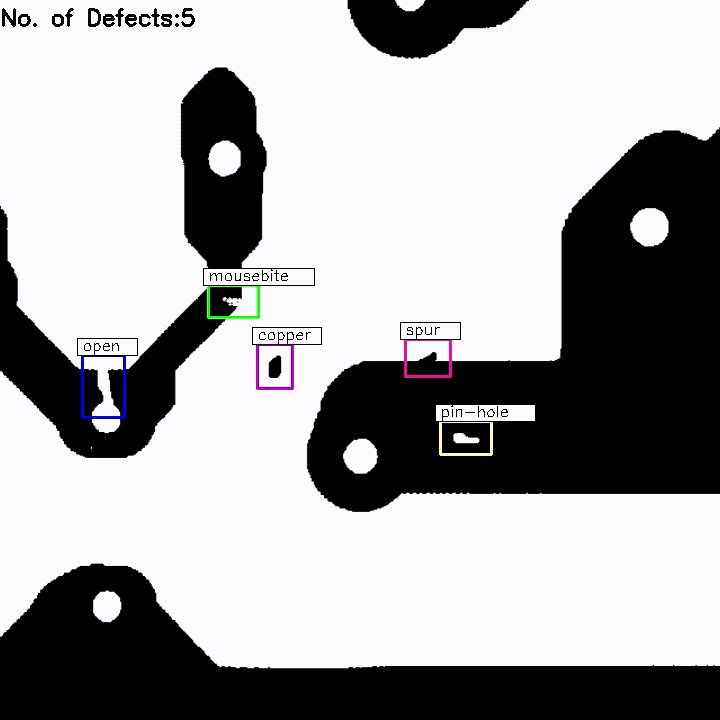
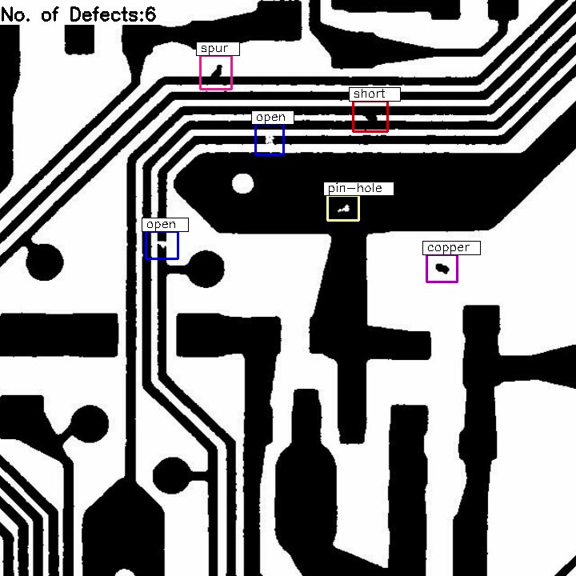
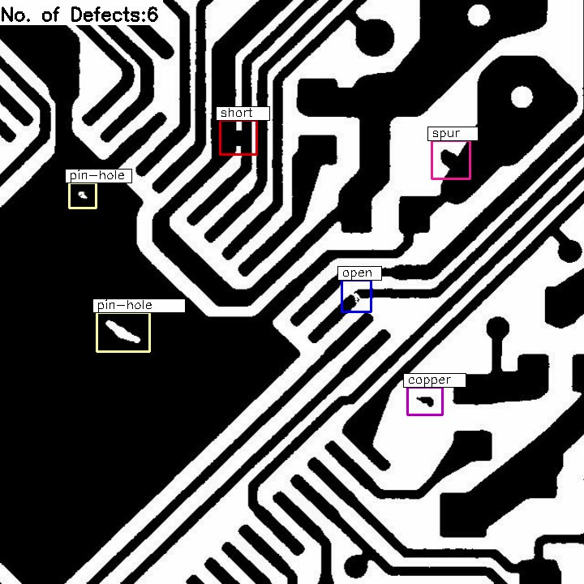
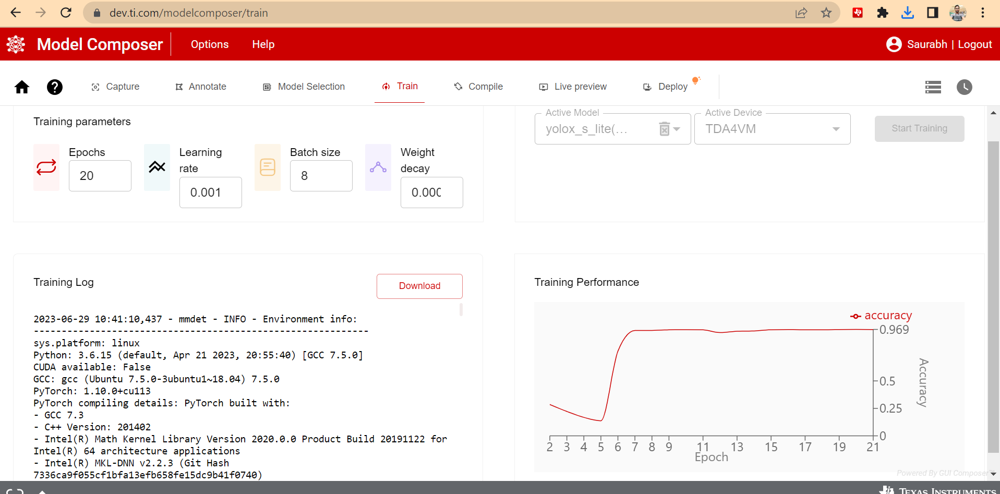
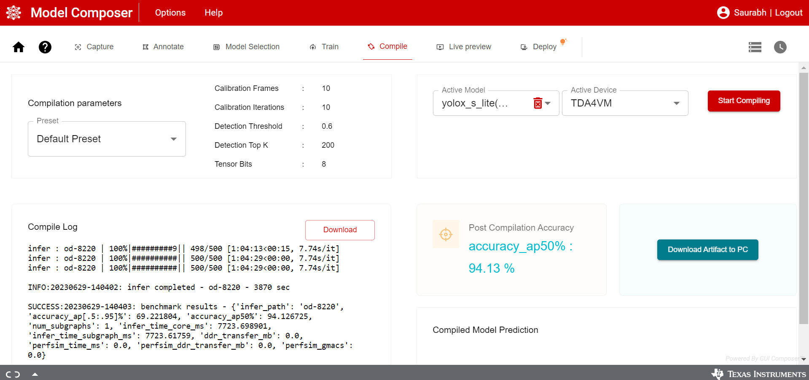
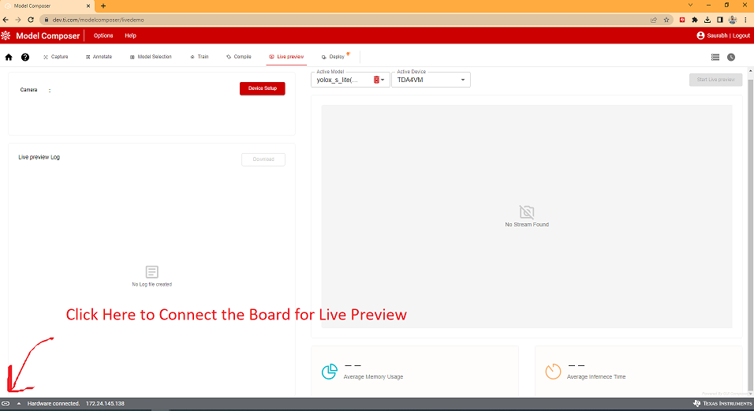
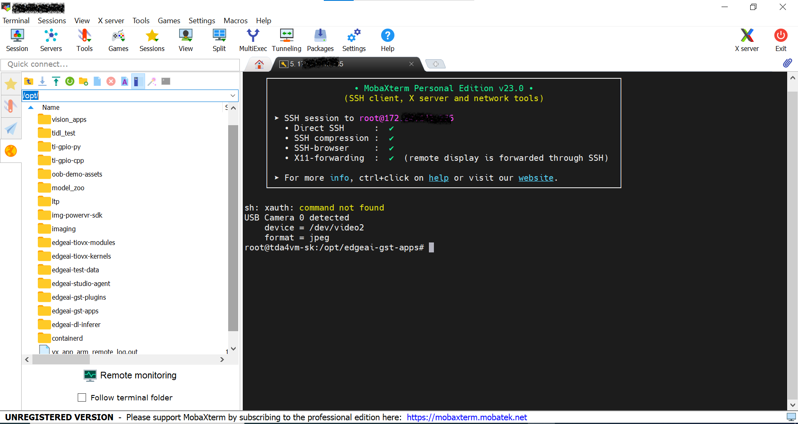

# Edge AI GStreamer Apps for PCB Defect Detection

> This Github Repository adds support for **PCB Defect Detection** Using [EDGE-AI-STUDIO](https://www.ti.com/tool/EDGE-AI-STUDIO) Model Composer tool for TI Embedded Processor.

## Table of content
- [Supported Devices](#supported-target-devices)
- [Steps to run](#steps-to-run-on-target-device)
- [Result](#results)
- [Dataset Overview](#surface-crack-dataset-overview)
- [How to Train Your Own Model Using EDGEAI-STUDIO](#how-to-train-your-own-model-using-edgeai-studio)
- [Custom Post Processing](#custon-post-processing)

## Supported Target Devices

| **DEVICE**              | **Supported**      |
| :---:                   | :---:              |
| SK-TDA4VM               | :heavy_check_mark: |

## Steps To Run on Target Device

1. Clone this repo in your target under /opt

    ```console
    root@tda4vm-sk:/opt# git clone https://github.com/TexasInstruments/edgeai-gst-apps-defect-detection.git
    root@tda4vm-sk:/opt# cd edgeai-gst-apps-defect-detection
    ```

2. Download model for Surface Crack detection

    ```console
    root@tda4vm-sk:/opt/edgeai-gst-apps-defect-detection# ./download_models.sh -d defect_detection
    ```

3. Download sample input video

    ```console
    root@tda4vm-sk:/opt/edgeai-gst-apps-human-pose# wget --proxy off http://software-dl.ti.com/jacinto7/esd/edgeai-test-data/demo_videos/human_pose_estimation_sample.h264 -O /opt/edgeai-test-data/videos/human_pose_estimation_sample.h264
    ```

4. Run the python app

    ```console
    root@tda4vm-sk:/opt/edgeai-gst-apps-defect-detection# cd apps_python
    root@tda4vm-sk:/opt/edgeai-gst-apps-defect-detection/apps_python# ./app_edgeai.py ../configs/surface_defect_detection.yaml
    ```

5. Compile cpp apps

    ```console
    root@tda4vm-sk:/opt/edgeai-gst-apps-defect-detection# ./scripts/compile_cpp_apps.sh
    ```

5. Run CPP app

    ```console
    root@tda4vm-sk:/opt/edgeai-gst-apps-defect-detection# cd apps_cpp
    root@tda4vm-sk:/opt/edgeai-gst-apps-defect-detection/apps_cpp# ./bin/Release/app_edgeai ../configs/surface_defect_detection.yaml
    ```

## Results
The Dataset Contains 1000 train images and 500 test images.
The model was trained with 1000 training images.  
The training accuracy of the the model is 96.9% .  

 |Training Parameter    |       |
| :---:                 | :---: |
| Epoches               | 20    |
| learning rate         | 0.001 |
| Batch Size            | 8     |

 |Compilation Parameter |       |
| :---:                 | :---: |
| Calibration Frames    | 10    |
| Calibration Iteration | 10    |
| Tensor Bits           | 8     |

 |Performance on the TDA4VM |       |
| :---:                 | :---: |
| Avg. DL Inference Time    | 10.17 ms


The Dataset was taken from (https://www.kaggle.com/datasets/yidazhang07/bridge-cracks-image?select=DeepPCB). This dataset was a part of the research paper which can be found out [here](https://arxiv.org/pdf/1902.06197.pdf).
On their Github page they have given an evaluation script to evaluate the result of the model on the test data.
On evaluating their our result with that script we got the mAP (Mean Average Precision Value) = 94.358 . Although this is less than what they have got, but we can run our model on more FPS than theirs.  
The Evaluation script given by them was not working so i modified it. The modified script is in [asset/evaluation_script](assets/evaluation_script) folder.
Follow This [Github Repo](https://github.com/tangsanli5201/DeepPCB) to get more insights of the dataset. 

<br>
<br>



### Sample result images

**Image 1**  



**Image 2**  




## Dataset Overview
The dataset is taken from this [Kaggle](https://www.kaggle.com/datasets/yidazhang07/bridge-cracks-image?select=DeepPCB). The same dataset is available on the [Github Repo](https://github.com/tangsanli5201/DeepPCB) also.  
The dataset contains 1,500 image pairs, each of which consists of a defect-free template image and an aligned tested image with annotations including positions of 6 most common types of PCB defects: open, short, mousebite, spur, pin hole and spurious copper.  
The images in this dataset were obtained by linear CCD scan of PCBs.  
A detailed description of the dataset can be found at the [Github](https://github.com/tangsanli5201/DeepPCB) page.

## Dataset Preprocessing
The given dataset contains the pair of Non defective image and corresponding defective image. Move Only defective Images to a different directory.  
The annotations for the each image is in a text file with the same name as image file.  
The text annotations files Contains the details of the bounding boxes and their label.   
Each defect are annotated as the format:`x1,y1,x2,y2,type` where (x1,y1) and (x2,y2) is the top left and the bottom right corner of the bounding box of the defect.  
`type` is an integer ID that follows the matches: 0-background (not used), 1-open, 2-short, 3-mousebite, 4-spur, 5-copper, 6-pin-hole.

The edgeai studio takes the dataset in the [COCO JSON](https://cocodataset.org/#home) format.

### Converting dataset into COCO JSON Format
- Remove all the temp(non_defective) files from the dataset. keep only images with defect.
- The dataset is in many groups in different folder.
So bring all the images in one folder and name it "images". and bring all the annotations in another folder and name it "annotations".
- Make a file named obj.names , put the names of the labels in this files. Each lable should be in a seperate lines. See this [assets/obj.names](assets/obj.names) Example.
- After this run this [assets/convert_annotations_to_COCO.py](assets/convert_annotations_to_COCO.py).
- Put the above script , image folder and annotations folder in same directory.
- The script can be modified acording to the need.

# Training Model Using EDGEAI-STUDIO

## About Edge AI Studio Model Composer
The [Edge AI studio model composer](https://dev.ti.com/modelcomposer/) train , optimize and Compile the AI model for TI Embedded Processor.   
It is a fully integrated no-code solution for training and compiling models for deployment into edge AI applications. It supports Bring-Your-Own-Data (BYOD), enabling the re-training of models from the TI Model Zoo with custom data. Deploy to your local development board.  
Currently, the Edge AI Studio can compose Object detection and Image Classification Task.

Below are the steps to use Edge AI Studio Model Composer

### EdgeAI Studio setup
1. On the model Composer main page, On the top bar of the GUI, click on Options → Serial Port Settings.
2. If TI Cloud Agent is not installed on your system, a prompt will appear with instructions on how to do so.
3. Install the TI cloud Agent.
4. ADD [TICloudAgent Bridge](https://chrome.google.com/webstore/detail/ticloudagent-bridge/pfillhniocmjcapelhjcianojmoidjdk) extension to the browser.
5. RELOAD the page, and reopen the Serial Port Settings.
6. Model Composer should automatically detect the appropriate serial port and baud rate to use. The Port and Baud Rate settings can be changed. However, it is recommended to use the default detected values.
**Note:** If using a Windows computer, the user may need to install additional drivers for ports to show up. (https://www.silabs.com/developers/usb-to-uart-bridge-vcp-drivers).\
Click on the link. Go to Downloads. Download and install ***CP210x Windows Drivers with Serial Enumerator***.
- For more details , on the main page go to "help --> Quick Start Guide" or  [click here](https://software-dl.ti.com/ccs/esd/training/workshop/edgeaistudio/modelcomposer_quick_start_guide.html)

###  Creating the project
1. Click on create new project.
2. From task type Drop Down menu select "Object detection" or "Image Classification" based on the task.
3. Write name of project
4. Click Start Composing

###  Dataset Preparation
Dataset can taken from various input sources.  

**Import Images from Local PC:**   
Existing Images can be imported directly in JPG, PNG format. Click on Import Images from Local PC. Select a folder from the local PC. On the right panel select the images and click Confirm. After that the images can be annotated in the "annotations" tabs of the EDGEAI-STUDIO.  
Once dataset is imported, data annotation can be done.

**Steps for annotating For Object Detection in Edgeai-Studio:**
1. Select a image from the left panel.
2. Click on the Square like shape left to the image.
3. Drag on the image where Box is to be drawn.
4. Fill / Select the label in pop up.
5. Repeat for All the images.
Note: Image can be zoomed , dragged aside also. Try all the icons left to the image.

**Steps for annotating For Image Classification in Edgeai-Studio:**
1. In classification first add all the label.
2. Click on the '+' icon on the top right.
3.  In the Pop Up window, Click on the + icon on the bottom left.
4.  Enter the label name and hit enter.
5.  Now select image from the left panel and select the label from right panel.
6.  Repeat for all the images.

Once Done with the annotations, the annotated data can be downloaded by clicking on Download symbol above the left panel.
It is recommended to Download the Annotated Data, incase by mistake project got deleted.

**Import Annotated dataset:** Annotated archive data can also be imported. The annotations should be in [COCO JSON](https://cocodataset.org/#home) Format. 

The directory of the zip file should be like this:
```yaml
dataset.zip
        |
        |--images
        |     |-- The image files should be here
        |
        |--annotations
              |--instances.json (COCO JSON FORMAT)
```

**NOTE:** The zip file should contain the only two folders: "images" and "annotations".  
Select the images and annotations folder simultaneously and zip it.  
**Don't** put the images and annotations in new folder and then zip it.


###  Model Selection
Once all the data is annotated, move to the next section.  

**Device Selection:** Select the Target device. Drag the slider to find the best trade-off between power and performance for your task.  

**Model Selection:**  Select a model according to the need "faster accuracy" or "faster Performance"

###  Train
Tune the training Parameter According to need. And Click on the start training button on the top-right.
The training Performance will be Shown as shown in below image.



Once the model is trained go to the next Section Compilation.


### Compilation
In Compilation Section, Choose the compilation parameters from the drop down.
If accuracy is not priority and only you need to compile to see the result select the "Best Speed Preset". 
After that Hit Start Compiling.
It will take some good amount of time.

After Compilation is over, the screen will be something like below image.



Click on **Download the Artifact to PC** to Download the Compiled model on the Local PC.

**Note :** Download the model to your PC before closing the browser. It may not be available when you log in again if you do not download it first.

The Downloaded model will look like this:


###  Live Preview

Once the model is compiled , Live Preview can be done. In live preview we can test our compiled model with live camera.
Some setting needs to be done before live preview.
Follow these step to live preview:
1. Select Live preview in the top part of the page.
2. Connect the board to PC by UART cable.
3. At the bottom left click on capsule like icon. After clicking , Hardware connected will be shown at bottom left.



4. Press the Device Setup button to configure the development board.
5. Press the Start Live preview button to download the model from the server to the EVM and run the preview.

# Deployment on Board

Connect the board with the PC using UART. [MobaXterm](https://mobaxterm.mobatek.net/download.html) can be used to remotely Connect to the target Device. Instead of Using Connecting by UART Cable one can connect through SSH also.

After Connecting to the board,  the `/opt` the directory structure will be like this:



Following are the important Directory for the Model Deployment.
`/opt/edgeai-gst-apps`  Contains the apps to run the model. It Contains Python apps and Cpp apps and Config files.\
`/opt/model_zoo` contains all the model. The downloaded model from the EDGE AI STUDIO will be uploaded here.\
`/opt/edgeai-test-data` contains the input data ( image , videos to run the model ). The test images to run on the board are uploaded here.
`/opt/edgeai-gst-apps/apps_python` it contains the files related to python apps.
`/opt/edgeai-gst-apps/apps_cpp` it contains the files related to cpp apps.

### Copying Downloaded model to the board

We can use `scp` Command to copy the model from our PC to the board.
 Go to the directory where Model is saved. Type the following command:

```scp -r model_folder_name root@ip_address_of_board:/opt/model_zoo```


### Importing Images on the board
Before Importing Images to the board, Rename the images file sequentially.
```0000.png , 0001.png ,0002.png ......... 000n.png```
It will help in slide showing images on the screen.

To copy the data to the board `scp` command can be used again.
1. Go to the folder where image folder is located.
2. Type the below command.
`scp -r image_folder_name root@ip_address_of_device:/opt/edgeai-test-data`
3. All the images files will be copied to `opt/edgeai-test-data/image_folder_name`

### Making Configuration file
Next task is to make Configuration file for the project. 
The config folder is located at `opt/edgeai-gst-apps/configs`
(You can make a copy of the existing `.yaml` file and edit it or else you can make a new `.yaml` file.)

**Component of config file**

```yaml
title: "PCB defect Crack Detection"
log_level: 2
inputs:
    input0:
        source: /dev/video2
        format: jpeg
        width: 1280
        height: 720
        framerate: 30
    input1:
        source: /opt/edgeai-test-data/videos/video_0000_h264.h264
        format: h264
        width: 1280
        height: 720
        framerate: 30
        loop: True
    input2:
        source: /opt/edgeai-test-data/pcb_defect_dataset/%04d.jpg
        width: 1280
        height: 720
        index: 0
        framerate: 1
        loop: True
models:
    model0:
        model_path: /opt/model_zoo/DD_pcb_defect_yolox_s_lite_onnxrt_TDA4VM
        alpha: 0.4
    model1:
        model_path: /opt/model_zoo/ss-8720
        alpha: 0.4
    model2:
        model_path: /opt/model_zoo/ONR-SS-8610-deeplabv3lite-mobv2-ade20k32-512x512
        alpha: 0.4
outputs:
    output0:
        sink: kmssink
        width: 1920
        height: 1080
        overlay-performance: false
    output1:
        sink: /opt/edgeai-test-data/output/output_video1.mp4
        width: 1920
        height: 1080
    output2:
        sink: /opt/edgeai-test-data/output/output_image_%04d.jpg
        width: 1920
        height: 1080

flows:
    flow0: [input2,model0,output0,[320,180,1280,720]]
```

1. inputs :  
This include all the input sources.\
We can have multiple input : input 0,input 1 ....... input n.\
             `source: /dev/video2` is for the camera connected to te board.\
             `source: /opt/edgeai-test-data/videos/video_0000_h264.h264` is for the video dataset saved at the given location.\
             `source: /opt/edgeai-test-data/pcb_defect_dataset/%04d.png` is for the images at the`/opt/edgeai-test-data/pcb_defect_dataset` . Note that the images will go one by one for input as slide show.
             `frame rate` Frame rate can be given here.
2. models :   
Like inputs we can have different model. Path of the model in model_zoo needs to be specified here.

3. outputs:  
In this section, output path is specified.\
`kmssink` correspond to the Monitor connected to the board.\
We can also save the results as video or images files by specifying their path.

4. flows :  
In flow we specify the combination of input source ,model name and outputs destination.  
For example:  
`flow0: [input2,model0,output0,[320,180,1280,720]]`  
This means use input 2, model 0, and output 0 to run.    
[320,180,1280,720]  
In this the first number and second number is for X and Y coordinate respectively from where we want to display the result on the monitor.  
The Third number shows the length of result to be shown along X axis .  
The Fourth number shows the length of result to be shown along Y axis .  

**Note** that we can write many flows using different combination of input , model and output. And we can see multiple output on the monitor. 


## 5. Running the Model
Once You have done below three things:
1. Copied model to the board
2. Copied dataset to the Board
3. Added Config file

The Model is ready to run.
We can run the model using python-apps or CPP apps.  
To run the Model with python apps:
1. Go to `/opt/edgeai-gst-apps/apps_python`
2. Type `./app_edgeai.py ../configs/config_file_name.yaml` in Terminal and hit Enter.

To run the Model with cpp apps:
1. Go to `/opt/edgeai-gst-apps/`
2. Compile the cpp app by this command `./scripts/compile_cpp_apps.sh`
3. Go to `/opt/edgeai-gst-apps/apps_cpp`
4. Type `./bin/Release/app_edgeai ../configs/surface_defect_detection.yaml` in Terminal and hit Enter.


## Custom Post Processing

From Object Detection , a bounding Box with label around the Object is displayed.
Apart from this we can Add some Custom Post Processing.
In PCB Defect detection we will can count the number of defect in the PCB.
The Code changes for that in `apps_python/post_processing.py` is given below.

- `bbox` in post_processing.py contains all the information about the bounding boxes. 
- Each line in bbox contains details of one bounding box. The first 4 elements are (x1,y1) , (x2,y2) coordinates of the bounding boxes. 5th element is the class_id of the defect. The 6th element is the confidence of that result. 
- From this information many information like number of defect in a pcb, number of different type of defect can be found.


We can find number of defect in a pcb by counting the number of bounding boxes.
```python
# COUNTING number of bounding boxes
b_num=0
for b in bbox:
    if b[5] > self.model.viz_threshold:
    b_num=b_num+1
```

The below code changes the bounding boxes color and and write the label name above bounding boxes. 
For doing this the openCV library's putText and rectangle function is used.
```python
if class_name=="open":
          cv2.rectangle(frame, (box[0], box[1]), (box[2], box[3]), (0, 0, 255), 2)
        if class_name=="short":
          cv2.rectangle(frame, (box[0], box[1]), (box[2], box[3]),(255, 0, 0), 2)
        if class_name=="mousebite":
          cv2.rectangle(frame, (box[0], box[1]), (box[2], box[3]), (0, 255, 0), 2)
        if class_name=="spur":
          cv2.rectangle(frame, (box[0], box[1]), (box[2], box[3]), (255, 51, 153), 2)
        if class_name=="copper":
          cv2.rectangle(frame, (box[0], box[1]), (box[2], box[3]), (204, 0, 204), 2)
        if class_name=="pin-hole":
          cv2.rectangle(frame, (box[0], box[1]), (box[2], box[3]), (255, 255, 153), 2)
        
        (label_width, label_height), baseline = cv2.getTextSize(class_name, cv2.FONT_HERSHEY_SIMPLEX, 0.5, 1)
        cv2.rectangle(
              frame,
              ( int(box[0])-5, int(box[1]) -5-label_height),
              (int(box[2])+label_width -25 , int(box[1])),
              (255,255,255),
              -1,)
        cv2.rectangle(
              frame,
              ( int(box[0])-5, int(box[1]) -5-label_height),
              (int(box[2])+label_width -25 , int(box[1])),
              (0,0,0),
              )
        cv2.putText(
            frame,
            class_name,
            (int(box[0]), int(box[1])-5),
            cv2.FONT_HERSHEY_SIMPLEX,
            0.5,
            (0,0,0),
            1,
        )
```

